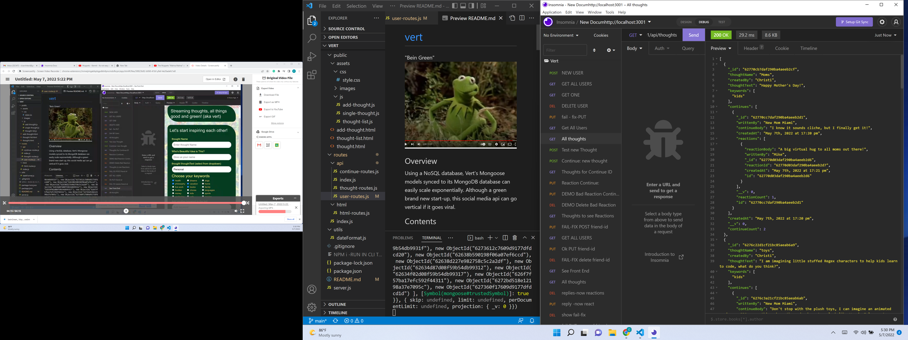

# [vert](https://www.merriam-webster.com/dictionary/vert)
"Bein Green"

## Overview
Using a NoSQL database, Vert's Mongoose models synced to its MongoDB database can easily scale exponentially.  Although a green brand new start-up, this social media api can go vertical if it goes viral.

## Contents
  * [Overview](#overview),
  * [Table of Contents](#contents),
  * [Description](#description),
  * [Installation](#installation),
  * [Notes](#notes),
  * [Usage](#usage),
  * [Credits](#credits),
  * [License](#license),
  * [Badges](#badges),
  * [Features](#features),
  * [Contribute](#contribute),
  * [Tests](#tests)

  ## Description
  * Considering the entire planet had a time=out, many of our local and world views have changed. It is time to make new friends, but how, where?
  * Social media apps have been focused upon linking existing family and friends, what about a safe place to practice conversations?
  * Let's face it, some of us are a little rusty and a safe batting cage to pitch a topic and strike up a conversation may help people experiment to gain confidence to apply starting conversations both in the virtual and in the "real" world.
  * The best aspect of the code presented is that it presents thoughts as conversation starters.  When sucessful, there is a continuation of the initial thought and then replies. When you see a large data set for the topic of conversation presented, it may be a great way to strike up a conversation with a group of people.
  * After all, "It's not easy being green," but it's ok, there may be a million, even a billion or so people who may feel the same way.

  ## Installation
  * As a back end app with a starter front end, see the video below for a preview of its features before cloning the software:
    1) In your root directory clone the vert repository: git clone git@github.com:ChristiLewis/vert.git ,
    2) Make sure you are in the root directory of vert, the project you just cloned: cd vert 
    3) Then verify your version of node.js: node -v,
    4) Check your version of npm included in node.js: npm -v,
    5) Install the general node package manager or npm: npm i,
    6) Verify your npm packages are installed: ls node_modules,
    7) Add a .gitignore file to spare your GitHub repository uploading all npm modules with each commit: touch .gitignore,
    8) Open the .gitignore file and add on line 1: node_modules,
    9) On line 2 .gitignore file add for mac users: .DS_Store,
    10) On line 3 .gitignore file add the reminder to remove node modules and re-install as needed: NPM i -RUN IN CLI TO BRING BACK NODE MODS.txt
    11) From the command line, run the app: npm start
    12) Open Insomnia and access the back end with http:localhost3001
    13) After you test the app, uninstall the npm packages to not clog your computer: npm uninstall, or simply delete from your folder.
    14) See below for additional notes or alternate installation instructions.

## Usage

Revised Criteria from the Module 18 Challenge:
>WHEN I open API GET routes in Insomnia for users, thoughts with authors, continuations of those thoughts, and reactions.
THEN the data for each of these routes is displayed in a formatted JSON,
WHEN I test API POST, PUT, and DELETE routes in Insomnia
THEN I am able to successfully create, update, and delete users and thoughts in my database.
WHEN I test API POST and DELETE routes in Insomnia
THEN I am able to successfully create and delete reactions to continuations of thoughts.
AS WELL AS add and remove reactions to a continuation of a thought or friends to a user's friend list.
>

  * 
  * 

  * [GitHub Repo](https://github.com/ChristiLewis/vert)

    ## Credits
  * [UM Coding Bootcamp](https://bootcamp.miami.edu/coding/)
  * [ChristiLewis](https://github.com/ChristiLewis)

## License
* Contents are credited as inspired by the bootcamp, API documentation licensing requirements, and as per permission by the team members mentioned above. 

## Badges
* There are no badges generated at this time. For more information: [shields.io](https://shields.io/)

## Features
* Realtime, anywhere interactions
* Offline input stored and synced once back online in Realtime.

## How-to-Contribute
* Any recommendations?  Please see [contributorCovenant](https://www.contributor-covenant.org)

## Tests
* There are no tests at this time, we are open to suggestions.
  